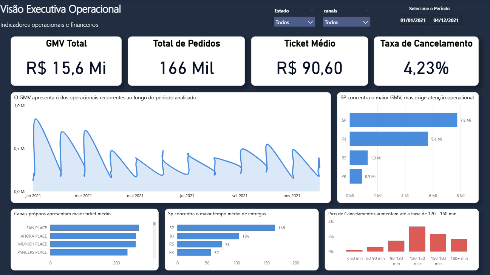
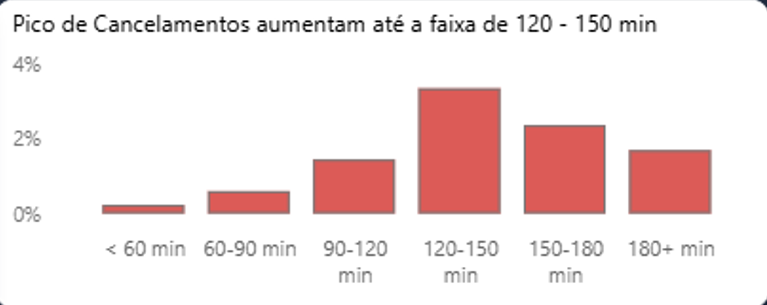

# Delivery Analytics SQL Project 🚚📊

Projeto de análise de dados end-to-end utilizando PostgreSQL e Power BI, simulando uma operação real de delivery inspirada em plataformas como IFOOD, Zé Delivery e marketplaces logísticos.

O projeto foi desenvolvido com foco em modelagem analítica, SQL aplicado a negócio, métricas operacionais e construção de portfólio para vagas de Dados, Analytics e Business Intelligence.

---

 ## 📊 Dashboard Preview



> Dashboard executivo desenvolvido em Power BI para análise operacional, logística e financeira.
---

## 📌 Objetivo do Projeto

Construir um pipeline analítico completo utilizando SQL, desde a ingestão dos dados até a geração de insights operacionais e executivos.

O projeto busca demonstrar capacidade de:

* Estruturar dados em ambiente analítico
* Trabalhar com modelagem dimensional (Data Warehouse)
* Criar métricas de negócio
* Desenvolver análises operacionais com SQL avançado
* Identificar problemas operacionais através de dados
* Traduzir dados em insights acionáveis

---

## 🔍 Principais Insights
* Marketplaces concentraram o maior volume de GMV da operação.
* Aumento do cycle time elevou significativamente a taxa de cancelamento.
* Hubs com maior volume operacional apresentaram pior SLA (P90).
* Motoboys concentraram a maior parte das entregas.
* Canais próprios apresentaram maior ticket médio.

---

## 🛠️ Tecnologias Utilizadas

### Banco de Dados
* PostgreSQL
* pgAdmin

### Linguagem
* SQL

### Visualização
* Power BI

### Conceitos Aplicados
* Data Warehouse
* Star Schema
* Data Quality
* Window Functions
* KPI Analytics
* Storytelling with Data

---

### 📂 Fonte dos Dados

Dataset público obtido no Kaggle, utilizado exclusivamente para fins educacionais e de construção de portfólio.

Base utilizada:
- Brazilian E-Commerce / Delivery Dataset
- Plataforma: Kaggle

Os dados passaram por processo de modelagem dimensional e tratamento analítico utilizando PostgreSQL.

---
## 🏗️ Estrutura do Projeto

```text
projeto-delivery-sql/
│
├── data/
│   └── raw/
│       ├── orders.csv
│       ├── deliveries.csv
│       ├── payments.csv
│       ├── stores.csv
│       ├── hubs.csv
│       ├── channels.csv
│       └── drivers.csv
│
├── sql/
│   ├── 00_schemas.sql
│   ├── 01_raw_tables.sql
│   ├── 02_dimensions.sql
│   ├── 03_facts.sql
│   ├── 04_views.sql
│   ├── 05_quality_checks.sql
│   └── 06_portfolio_queries.sql
│
├── docs/
│   ├── dashboard_prints/
│   └── power_bi/
│
└── README.md
```
---

## 🗂️ Arquitetura Analítica

Camada RAW

Importação dos arquivos CSV originais sem transformação estrutural.

Tabelas RAW
* raw.orders
* raw.deliveries
* raw.payments
* raw.stores
* raw.hubs
* raw.channels
* raw.drivers

Data Warehouse (DW)

Dimensões
* dw.dim_store
* dw.dim_hub
* dw.dim_channel
* dw.dim_driver
* dw.dim_date

Fatos
* dw.fact_orders
* dw.fact_deliveries
* dw.fact_payments

Camada Analytics

Principais Views

* analytics.vw_order_360
* analytics.vw_kpi_daily
* analytics.vw_kpi_by_state
* analytics.vw_kpi_by_channel
* analytics.vw_cancel_vs_cycle

---

## 📊 Principais Análises Desenvolvidas

📈 KPIs Executivos
* GMV
* Volume de pedidos
* Ticket médio
* Taxa de cancelamento
* SLA operacional

## 🚚 Operação Logística

* Relação entre distância e tempo de entrega
* Performance por modal de entrega
* Tempo médio por estado
* P90 de cycle time
* Ranking de hubs críticos

---

## ❌ Cancelamentos

Análise da relação entre:

* tempo de entrega
* SLA operacional
* distância
* cancelamentos

### Principal Insight

A taxa de cancelamento aumenta progressivamente conforme o cycle time cresce, atingindo pico operacional na faixa entre 120 e 150 minutos.




---

## 💳 Pagamentos
* Volume por método de pagamento
* Taxa de aprovação
* Chargeback rate
* Distribuição de status

---

## 🧪 Qualidade de Dados

Validações implementadas:

* registros órfãos
* deliveries sem pedidos
* payments sem correspondência
* stores sem hubs
* análise de nulos
* tratamento de outliers operacionais

---

## 🚀 Como Executar o Projeto

1. Criar banco PostgreSQL
```sql
CREATE DATABASE delivery_dw;
```

2. Executar scripts SQL na ordem
```text
00_schemas.sql
01_raw_tables.sql
```

3. Importar arquivos CSV

Importar os arquivos da pasta:

data/raw/

Utilizando:

pgAdmin → Import/Export Data

4. Executar restante dos scripts
```text
02_dimensions.sql
03_facts.sql
04_views.sql
05_quality_checks.sql
06_portfolio_queries.sql
```

---

## 📚 Principais Conceitos Aplicados

Modelagem dimensional
* SQL analítico
* Window Functions
* Percentile Functions
* Data Quality
* KPIs operacionais
* Storytelling com dados

---

## 🎯 Próximos Passos

* Evoluir para análises preditivas
* Criar modelos de previsão de SLA
* Desenvolver modelos de previsão de cancelamento
* Automatizar pipeline de dados
* Adicionar camada de Machine Learning

---

## 👨‍💻 Sobre

Profissional em transição para a área de Dados, desenvolvendo projetos focados em Analytics, SQL, BI e Ciência de Dados aplicados a problemas reais de negócio.

---

## 🔗 Contato

=======

### LinkedIn


[LinkedIn](https://www.linkedin.com/in/ivan-rufino-data)

### GitHub
[GitHub](https://github.com/rufinoivan012-a11y)
